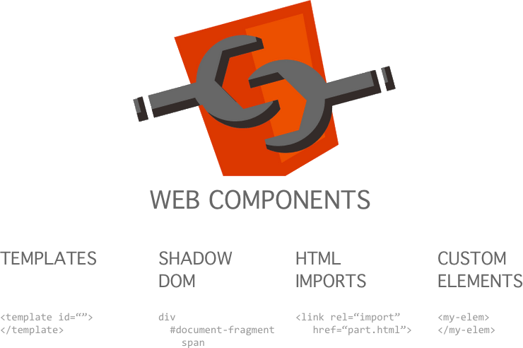

# Web Components  

<!-- 

[Live Link](https://fullstack-mern.herokuapp.com/)

**Functionalities:** Adding & deleting shopping items.

I am using **Mongo, React, Redux**, reactstrap (for dealing with bootstrap) and **Express** at the backend.

To run this app:

* `git clone https://github.com/RohitoOo/Mern_Shopping_List.git` - Clone this repo
* `cd into_directory` - Access Root Directory
* `npm install` - Install Back End Dependencies
* `cd client && npm install` - Install Front End Dependencies
* `cd .. && npm run dev` - Launch Application Locally   

*Make Sure You Have nodeJs Installed Locally*

Personal Portfolio
-------------------

[Rohit Bhambhani](http://rohito.com) -->
